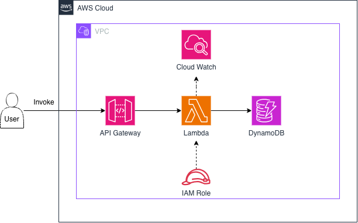

# Serverless Lambda Architecture

A reference architecture for a fully serverless request/response API on AWS, built around Amazon API Gateway, AWS Lambda, and Amazon DynamoDB, with IAM for access control and Amazon CloudWatch for observability.



## What is this?

This repository documents a **serverless event-driven architecture**: an API whose compute runs only when a request arrives, with no servers to provision, patch, or scale. The user calls an HTTP endpoint, API Gateway routes the request to a Lambda function, the function reads from or writes to a DynamoDB table, and the response travels back the same way. All resources run inside the AWS Cloud, with the workload components deployed within a VPC boundary.

This pattern is a common foundation for REST/CRUD APIs, mobile and web backends, webhooks, and internal microservices — anywhere you want pay-per-request compute with automatic scaling from zero to thousands of concurrent requests.

## Architecture Overview

```
User ──Invoke──▶ API Gateway ──▶ Lambda ──▶ DynamoDB
                                   │  ▲
                                   │  └─── IAM Role (execution permissions)
                                   ▼
                               CloudWatch (logs & metrics)
```

### Request Flow

1. **User → API Gateway**: A client (browser, mobile app, or another service) invokes the API over HTTPS. API Gateway is the single public entry point — it terminates TLS, validates and routes the request, and can enforce throttling, request validation, API keys, and authorization before any compute runs.
2. **API Gateway → Lambda**: The gateway triggers the Lambda function (typically via proxy integration), passing the HTTP method, path, headers, and body as the event payload. Lambda spins up an execution environment on demand; no capacity is pre-provisioned.
3. **Lambda → DynamoDB**: The function contains the business logic. It processes the event and performs the data operation — `GetItem`, `PutItem`, `Query`, `UpdateItem`, or `DeleteItem` — against the DynamoDB table using the AWS SDK.
4. **Response**: DynamoDB returns the result to Lambda, Lambda returns a structured response to API Gateway, and API Gateway maps it to an HTTP response for the user.

## Components

### Amazon API Gateway
The managed front door for the API. Responsibilities:

- Exposes public HTTPS endpoints and routes each method/path to the Lambda function
- Handles authentication/authorization hooks (IAM auth, Cognito authorizers, or Lambda authorizers)
- Provides throttling, usage plans, request/response transformation, and CORS handling
- Scales automatically with traffic and charges per request

### AWS Lambda
The serverless compute layer where the application logic lives:

- Runs code only in response to invocations — no idle servers, billed per request and per millisecond of execution
- Scales horizontally and automatically: each concurrent request gets its own execution environment
- Stateless by design — all persistent state lives in DynamoDB, which keeps the function easy to scale and reason about
- Deployed inside the VPC boundary shown in the diagram, alongside the other workload components

### Amazon DynamoDB
The persistence layer — a fully managed, serverless NoSQL key-value/document database:

- Single-digit-millisecond latency at any scale, with on-demand capacity that matches the pay-per-use model of the rest of the stack
- No connection pools or servers to manage, which pairs well with Lambda's many short-lived execution environments
- Supports point-in-time recovery, TTL expiry, and DynamoDB Streams if downstream event processing is added later

### IAM Role (Lambda Execution Role)
Security is enforced through identity, not network location. The Lambda function assumes an **execution role** at invocation time (shown as the dashed arrow into Lambda):

- Grants the function *least-privilege* access — e.g., only `dynamodb:GetItem`/`PutItem` on the specific table, and permission to write logs to CloudWatch
- No credentials are stored in code or configuration; AWS injects temporary credentials automatically
- Keeps the blast radius small: the function can touch only the resources its role explicitly allows

### Amazon CloudWatch
The observability layer (dashed arrow from Lambda):

- **Logs**: every Lambda invocation streams `stdout`/`stderr` and runtime reports to CloudWatch Logs
- **Metrics**: invocation count, duration, error rate, throttles, and concurrency are recorded automatically for Lambda and API Gateway
- **Alarms & dashboards**: metrics can drive alarms (e.g., alert on elevated 5xx errors or function timeouts) and operational dashboards

## Why this architecture?

- **No server management** — every tier (gateway, compute, database) is fully managed by AWS
- **Pay per use** — cost scales with actual requests; the stack costs nearly nothing when idle
- **Automatic scaling** — API Gateway, Lambda, and DynamoDB all scale independently and automatically with load
- **High availability by default** — each service is redundant across multiple Availability Zones with no extra configuration
- **Security in depth** — a single controlled entry point, least-privilege IAM roles, and no long-lived credentials

## Trade-offs to be aware of

- **Cold starts**: an infrequently used function may add tens to hundreds of milliseconds on first invocation (mitigations: provisioned concurrency, smaller deployment packages)
- **Execution limits**: Lambda invocations are capped (15-minute max runtime; API Gateway responses time out at 29 seconds), so long-running work should move to queues or Step Functions
- **NoSQL modeling**: DynamoDB requires access-pattern-first data modeling rather than ad-hoc relational queries

## Files

| File | Description |
|------|-------------|
| `serverless-lambda-crud-api-architecture.png` | Architecture diagram (exported from draw.io) |
| `console-guide/` | Step-by-step AWS Console implementation guide (GUIDE.md), with screenshots and the Lambda source |
| `README.md` | This document |

The source diagram (draw.io) can be edited in [draw.io / diagrams.net](https://www.diagrams.net/) and re-exported as PNG.
