# Step-by-Step Guide: Building the Serverless Lambda Architecture in the AWS Console

This guide walks through implementing the architecture from [`README.md`](../README.md) — **API Gateway → Lambda → DynamoDB**, with an IAM execution role and CloudWatch logging — entirely from the AWS Console, one step at a time. Every screenshot in `screenshots/` was captured during a real build in a live AWS account.

**What we build:** a simple *items API* — `GET /items` lists records from a DynamoDB table, `POST /items` creates one.

**Region used:** `us-east-1` (N. Virginia). Sign in to the console and make sure the region selector in the top-right shows **United States (N. Virginia)** before starting.

**Cost:** every service used here is serverless and pay-per-request (DynamoDB on-demand, Lambda, HTTP API). At tutorial scale the cost is effectively zero, and everything is deleted in the Cleanup section at the end if you don't want to keep it.

---

## Architecture recap

```
User ──HTTPS──▶ API Gateway (HTTP API) ──▶ Lambda (Python) ──▶ DynamoDB (items)
                                             │        ▲
                                             │        └── IAM execution role
                                             ▼
                                         CloudWatch Logs
```

Build order matters: the database first, then the role that grants access to it, then the function that uses the role, then the API that fronts the function.

---

## Step 1 — Create the DynamoDB table

Open **DynamoDB** from the console search bar. On the Tables page you start with no tables in the region.

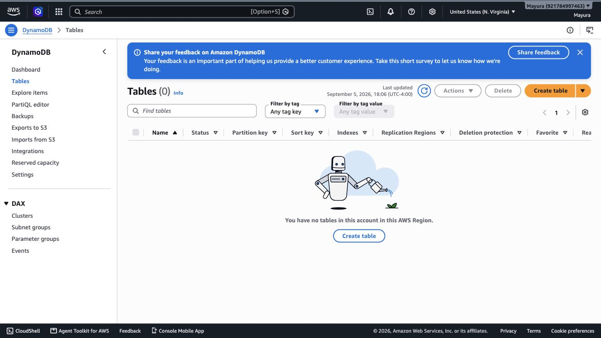

Click **Create table** and fill in:

| Field | Value |
|---|---|
| Table name | `items` |
| Partition key | `id` — type **String** |
| Sort key | *(leave empty)* |
| Table settings | **Default settings** |

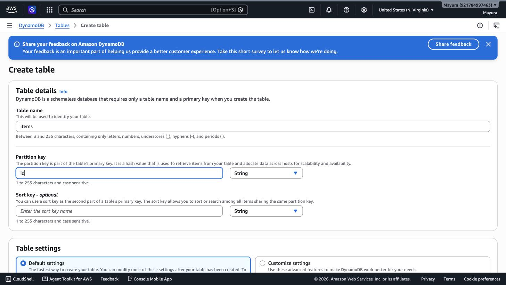

The default settings give you the serverless-friendly configuration — note **Capacity mode: On-demand**, so you pay per request with no provisioned capacity to manage:

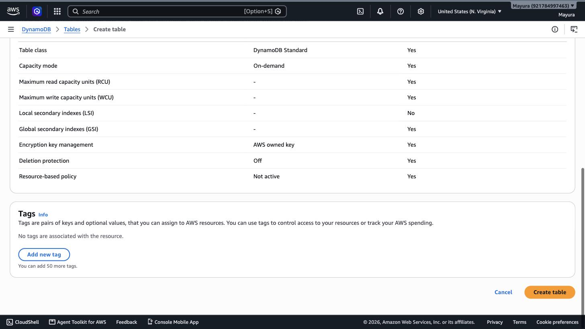

Click **Create table**. The table shows status *Creating* for a few seconds, then *Active*:

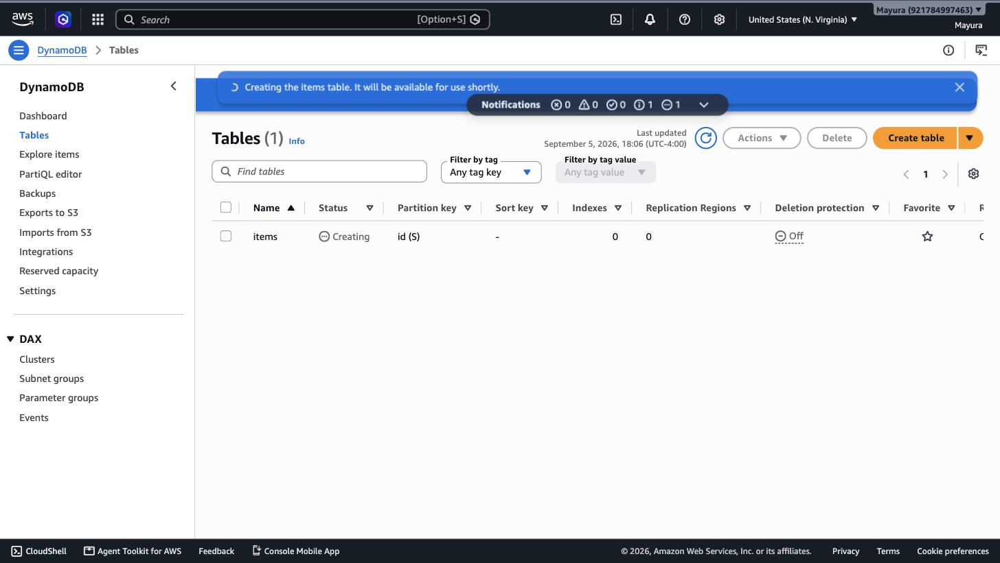

> **Why a partition key called `id`?** DynamoDB requires a primary key. Our Lambda generates a UUID for each item and stores it in `id`.

---

## Step 2 — Create the IAM execution role

The Lambda function needs an identity that allows it to (a) write logs to CloudWatch and (b) read/write the DynamoDB table. That identity is an **execution role**.

Open **IAM → Roles → Create role**.

**Step 2a — Trusted entity.** Choose **AWS service**, and under *Service or use case* pick **Lambda**. This writes the trust policy that lets the Lambda service assume the role.

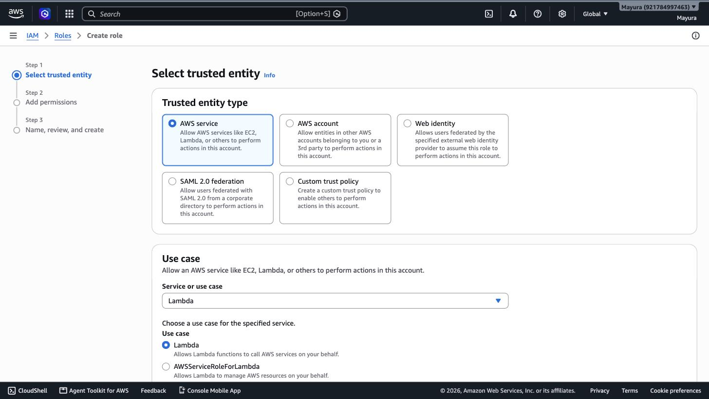

**Step 2b — Permissions.** Search for and check these two AWS-managed policies:

- `AWSLambdaBasicExecutionRole` — allows writing logs to CloudWatch Logs
- `AmazonDynamoDBFullAccess` — allows DynamoDB operations

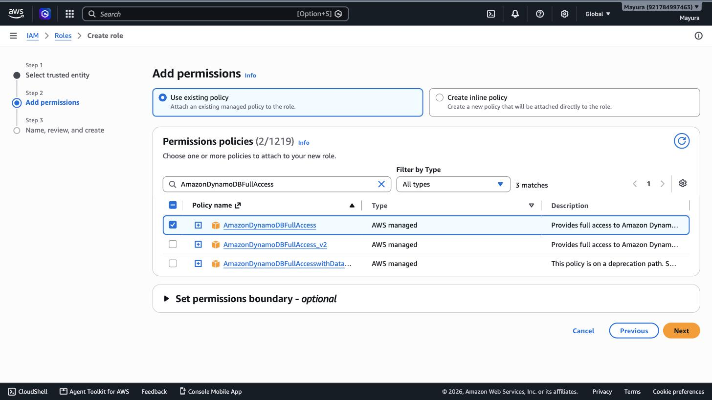

> **Production note:** `AmazonDynamoDBFullAccess` is broad. For a real workload, replace it with an inline policy that allows only `dynamodb:GetItem`, `PutItem`, `Scan`, `Query`, `UpdateItem`, `DeleteItem` on the specific table ARN (`arn:aws:dynamodb:us-east-1:<account>:table/items`). Least privilege keeps the blast radius small.

**Step 2c — Name and create.** Name the role `items-api-lambda-role`:

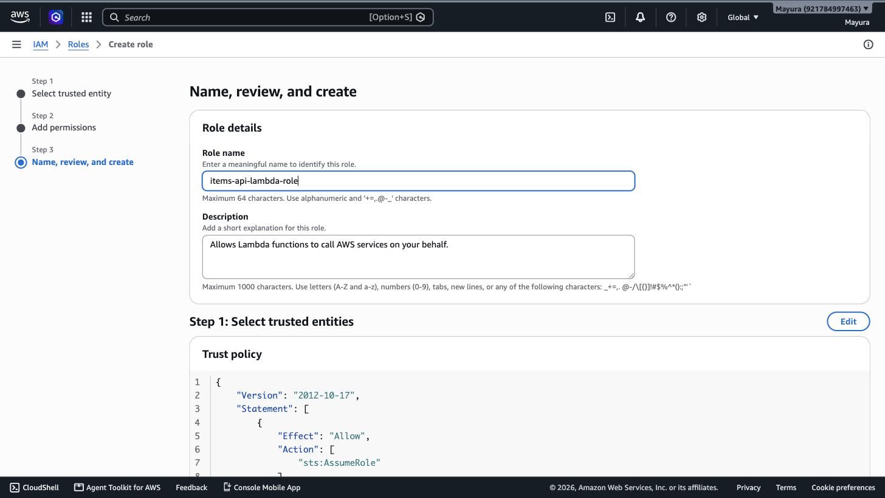

Review shows the trust policy and both permission policies attached:

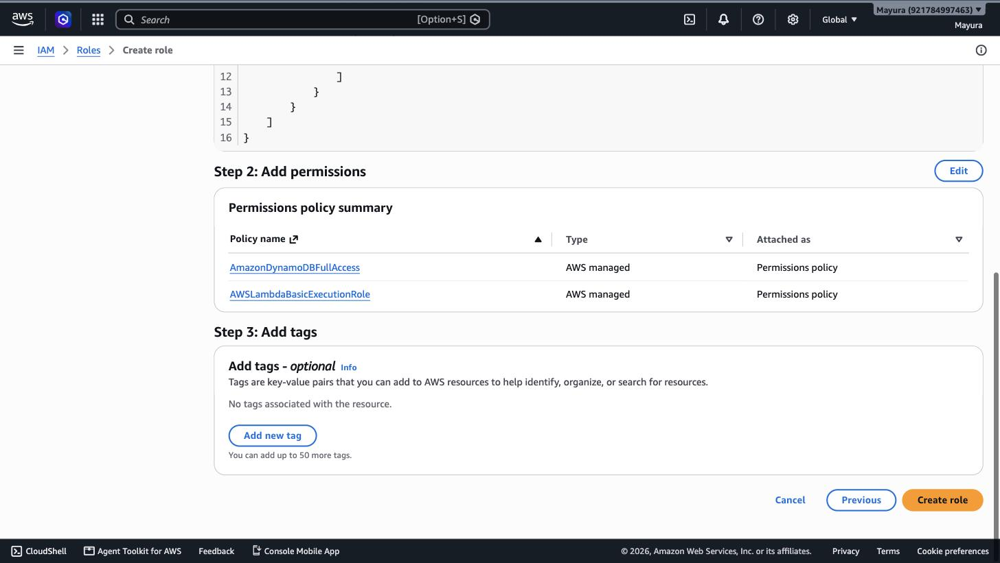

Click **Create role** — the green banner confirms it:

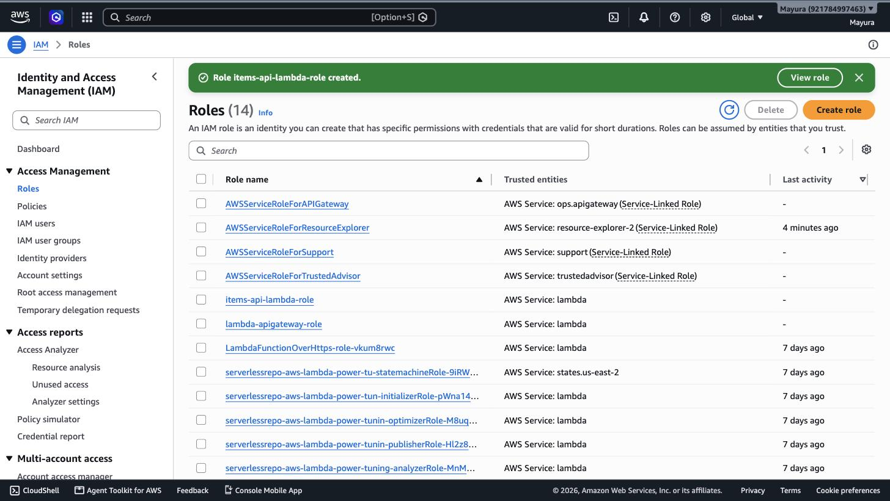

---

## Step 3 — Create the Lambda function

Open **Lambda → Create function** and choose **Author from scratch**:

| Field | Value |
|---|---|
| Function name | `items-api` |
| Runtime | **Python 3.14** |
| Architecture | x86_64 (default) |

Then expand **Additional settings**, enable **Custom execution role**, and pick the role from Step 2 — `items-api-lambda-role`:

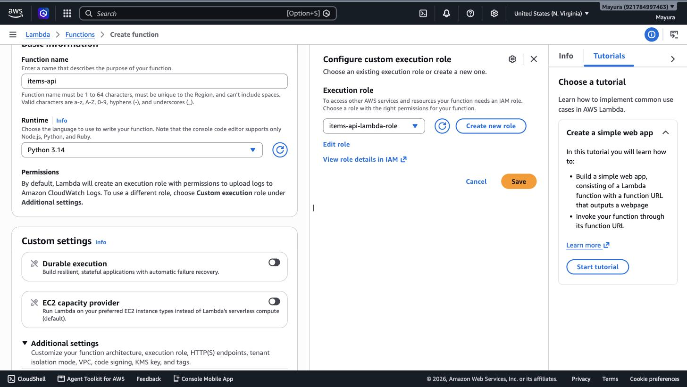

Click **Create function**:

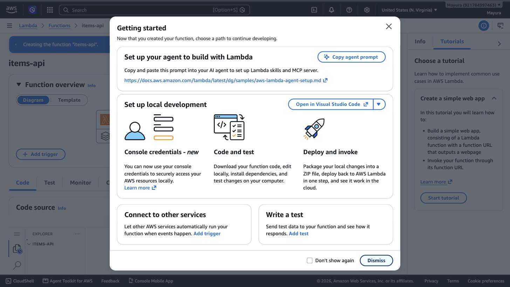

**Step 3b — Add the code.** In the **Code** tab, replace the contents of `lambda_function.py` with:

```python
import json
import uuid

import boto3

dynamodb = boto3.resource("dynamodb")
table = dynamodb.Table("items")


def respond(status_code, data):
    return {
        "statusCode": status_code,
        "headers": {"Content-Type": "application/json"},
        "body": json.dumps(data, default=str),
    }


def lambda_handler(event, context):
    method = event.get("requestContext", {}).get("http", {}).get("method", "")
    try:
        if method == "GET":
            result = table.scan()
            return respond(200, result.get("Items", []))

        if method == "POST":
            body = json.loads(event.get("body") or "{}")
            if not body:
                return respond(400, {"error": "Request body is required"})
            item = dict(body)
            item["id"] = str(body.get("id") or uuid.uuid4())
            table.put_item(Item=item)
            return respond(201, item)

        return respond(405, {"error": f"Method {method} not allowed"})
    except Exception as exc:
        return respond(500, {"error": str(exc)})
```

How it works: API Gateway (HTTP API, payload v2.0) passes the HTTP method in `event.requestContext.http.method`. `GET` scans the table and returns all items; `POST` parses the JSON body, adds a UUID `id`, and writes the item with `put_item`. Every response goes through `respond()`, which builds the `statusCode`/`body` shape API Gateway expects.

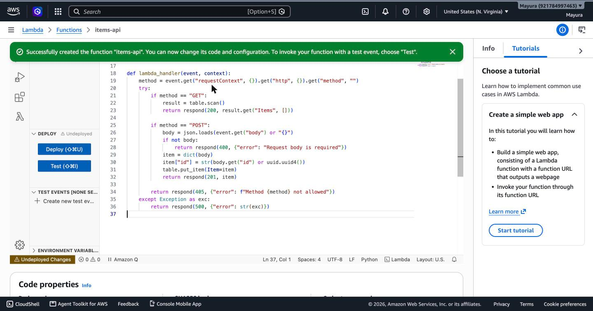

**Step 3c — Deploy.** Click **Deploy** (⇧⌘U). The banner confirms the update and the DEPLOY panel shows *Current*:

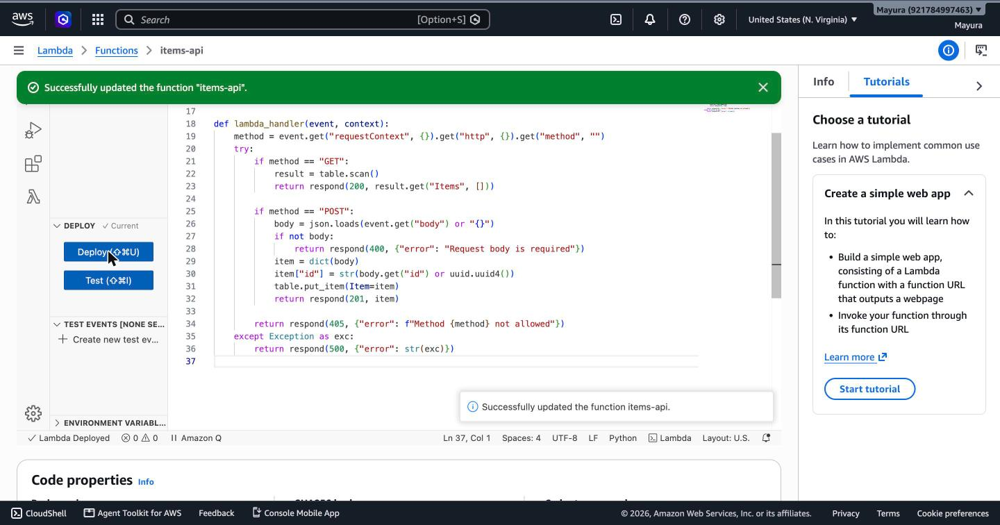

---

## Step 4 — Create the API Gateway HTTP API

Open **API Gateway → Create API** and click **Build** on the **HTTP API** card (cheaper and simpler than REST API, and everything this architecture needs):

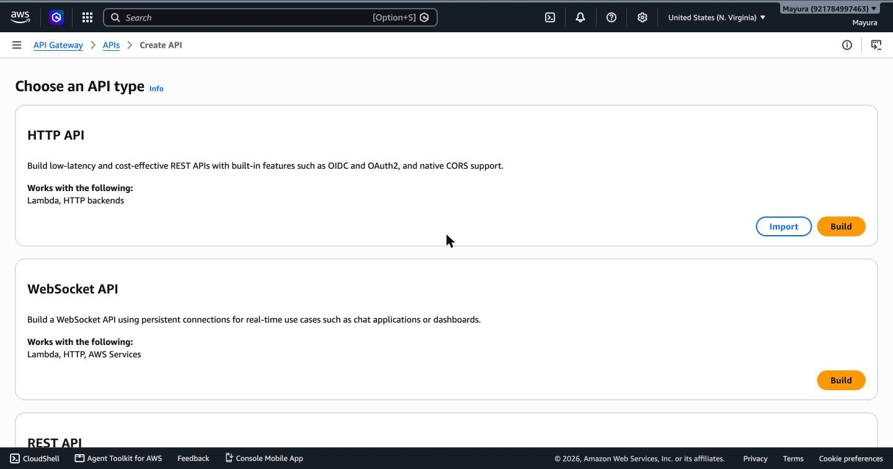

**Step 4a — Configure API.** Name it `items-http-api`, click **Add integration**, choose **Lambda**, and select the `items-api` function (the console autocompletes its ARN):

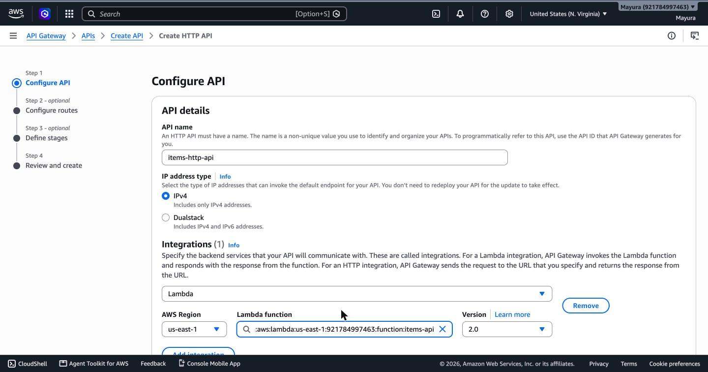

Click **Next**. Adding the integration here also makes API Gateway create the *resource-based permission* that allows this API to invoke the function — no manual permission wiring needed.

**Step 4b — Configure routes.** Create two routes, both targeting the `items-api` integration:

| Method | Resource path | Integration target |
|---|---|---|
| GET | `/items` | items-api |
| POST | `/items` | items-api |

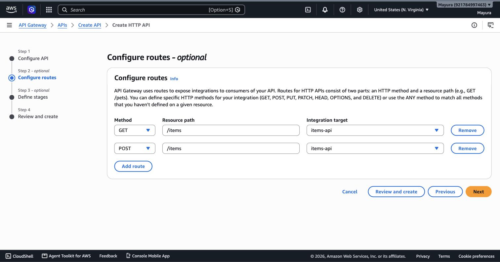

**Step 4c — Stages.** Keep the default: stage `$default` with **Auto-deploy** enabled, so every change deploys immediately:

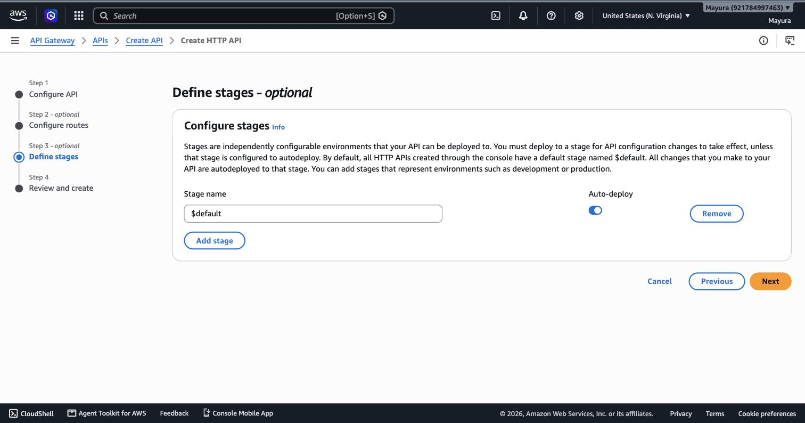

**Step 4d — Review and create.**

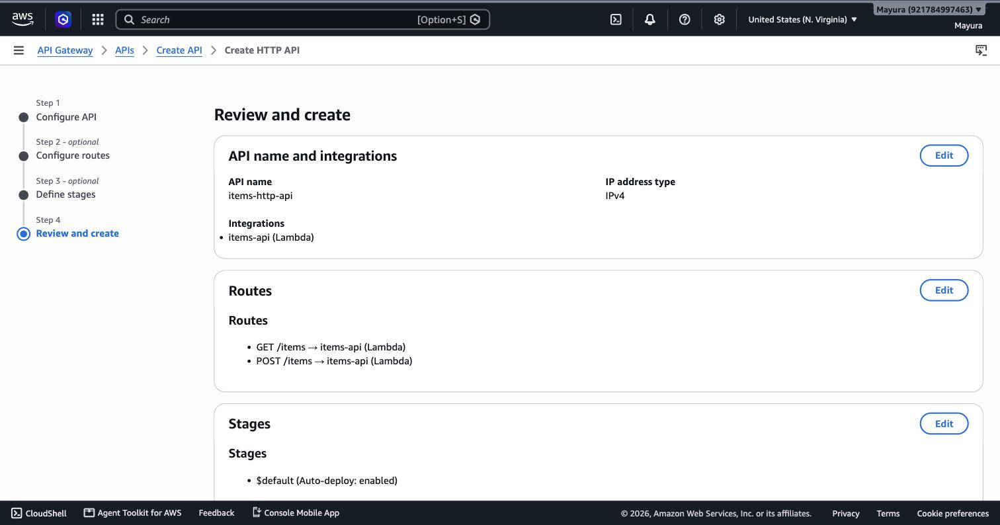

Click **Create**. The API is live immediately:

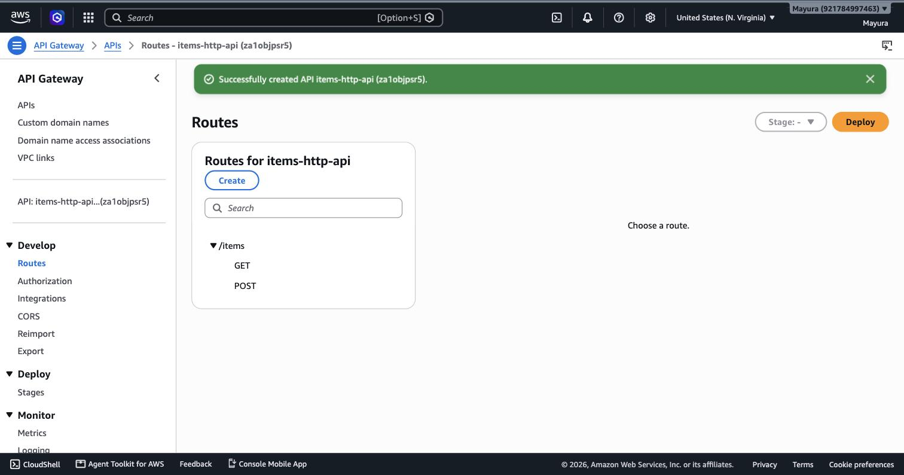

Find the **Invoke URL** on the API details page (also under Stages). For this build it was:

```
https://za1objpsr5.execute-api.us-east-1.amazonaws.com
```

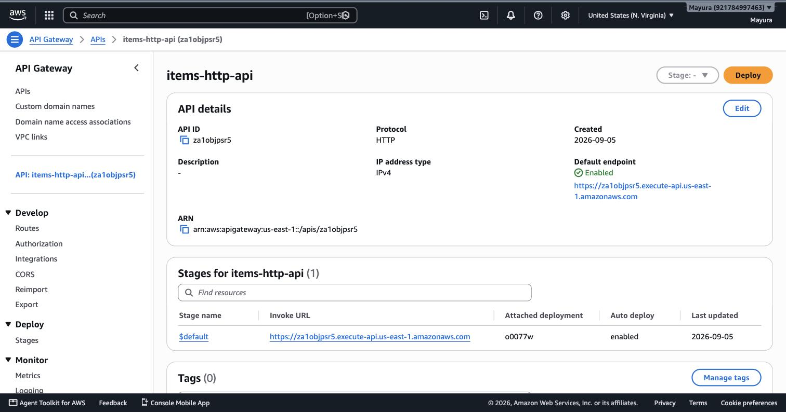

---

## Step 5 — Test end to end

**GET before any data** — opening `<invoke-url>/items` in a browser returns an empty list, which proves the whole chain (API Gateway → Lambda → DynamoDB scan) works:


**POST two items** — from a terminal:

```bash
curl -X POST "https://<api-id>.execute-api.us-east-1.amazonaws.com/items" \
  -H "Content-Type: application/json" \
  -d '{"name": "MacBook Pro", "category": "laptop", "price": 2499}'

curl -X POST "https://<api-id>.execute-api.us-east-1.amazonaws.com/items" \
  -H "Content-Type: application/json" \
  -d '{"name": "Coffee Mug", "category": "kitchen", "price": 12}'
```

Each returns `201` with the stored item, including its generated `id`.

**GET again** — both items come back:

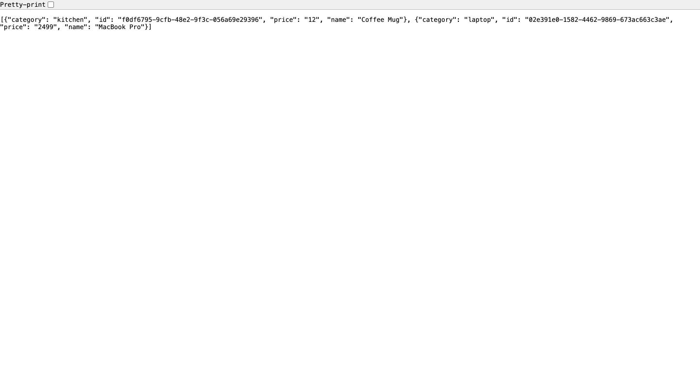

**Verify in DynamoDB** — *Explore items* on the `items` table shows the same two records (Items returned: 2):

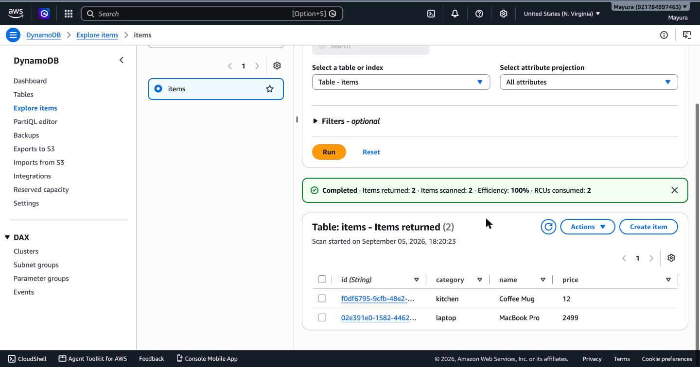

---

## Step 6 — Observe in CloudWatch

Lambda created the log group `/aws/lambda/items-api` automatically on first invocation — this is the `AWSLambdaBasicExecutionRole` policy at work:

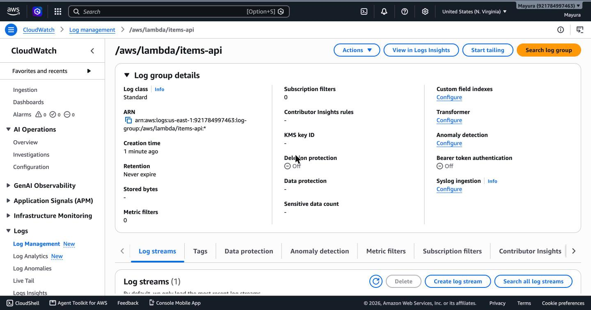

Open the latest log stream to see one `START`/`END`/`REPORT` trio per invocation, with duration, billed duration, and memory usage — the raw material for alarms and dashboards:

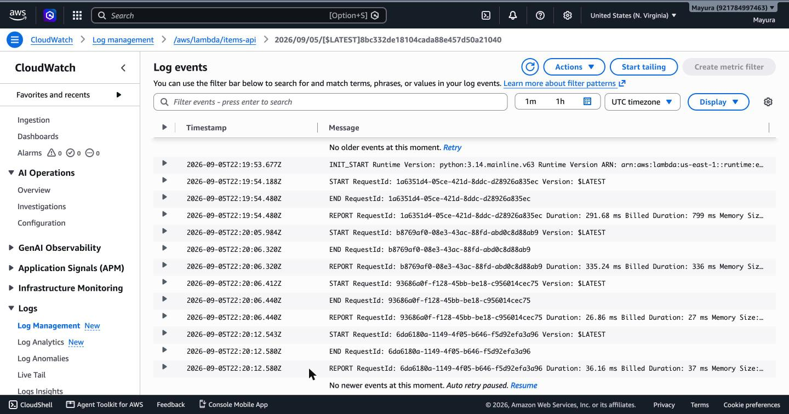

---

## Troubleshooting

- **`{"message": "Internal Server Error"}` from the API** — open the CloudWatch log stream; the Python traceback is there. The most common cause is the execution role missing DynamoDB permissions or a mismatched table name.
- **`{"message": "Not Found"}`** — the path or method doesn't match a route. Routes are case-sensitive and exact (`/items`, not `/Items` or `/items/`).
- **Table name errors** — the code reads table `items` in the same region as the function; if you renamed the table, update `dynamodb.Table("items")`.
- **Changes not taking effect** — Lambda code must be **deployed** (Deploy button), and API changes deploy automatically only because `$default` has auto-deploy on.

## Cleanup (optional)

To remove everything, delete in this order: the API (`API Gateway → items-http-api → Delete`), the function (`Lambda → items-api → Actions → Delete`), the table (`DynamoDB → items → Delete`, which also removes the data), the role (`IAM → Roles → items-api-lambda-role → Delete`), and the log group (`CloudWatch → Log groups → /aws/lambda/items-api → Actions → Delete`).

## Resources created in this walkthrough

| Resource | Name | Service |
|---|---|---|
| Table | `items` (partition key `id`, on-demand) | DynamoDB |
| Role | `items-api-lambda-role` | IAM |
| Function | `items-api` (Python 3.14) | Lambda |
| API | `items-http-api` (HTTP API, `$default` stage) | API Gateway |
| Log group | `/aws/lambda/items-api` | CloudWatch |
